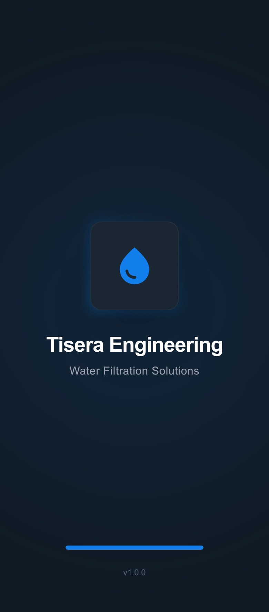
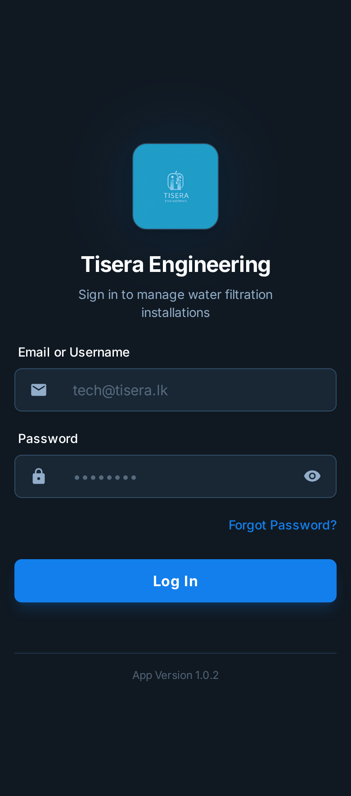
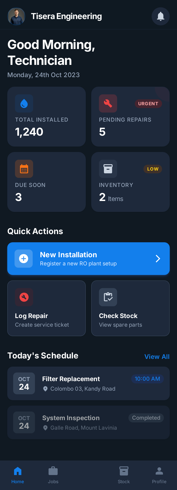

# Tisera Engineering - RO Filter App

A comprehensive Flutter application designed for managing RO (Reverse Osmosis) filter systems, tracking maintenance schedules, and monitoring water quality for Tisera Engineering clients.

## Screenshots

| Splash Screen | Login Screen | Dashboard |
| :---: | :---: | :---: |
|  |  |  |

## Getting Started

Follow these instructions to get the project up and running on your local machine for development and testing purposes.

### Prerequisites

- [Flutter SDK](https://docs.flutter.dev/get-started/install) (Latest stable version)
- [Dart SDK](https://dart.dev/get-dart)
- Android Studio / VS Code with Flutter extension
- An Emulator or physical device

### Installation

1. **Clone the repository:**
   ```bash
   git clone https://github.com/your-username/ro-filter-app.git
   cd ro-filter-app
   ```

2. **Install dependencies:**
   ```bash
   flutter pub get
   ```

### Configuration

1. **Environment Variables:**
   Create a `.env` file in the root directory and add the necessary environment variables required for API integrations.

2. **Firebase Setup:**
   - Create a new project in the [Firebase Console](https://console.firebase.google.com/).
   - Add Android/iOS apps to the Firebase project.
   - Download and place `google-services.json` in `android/app/` and `GoogleService-Info.plist` in `ios/Runner/`.

### Usage

To run the application in debug mode:

```bash
flutter run
```
